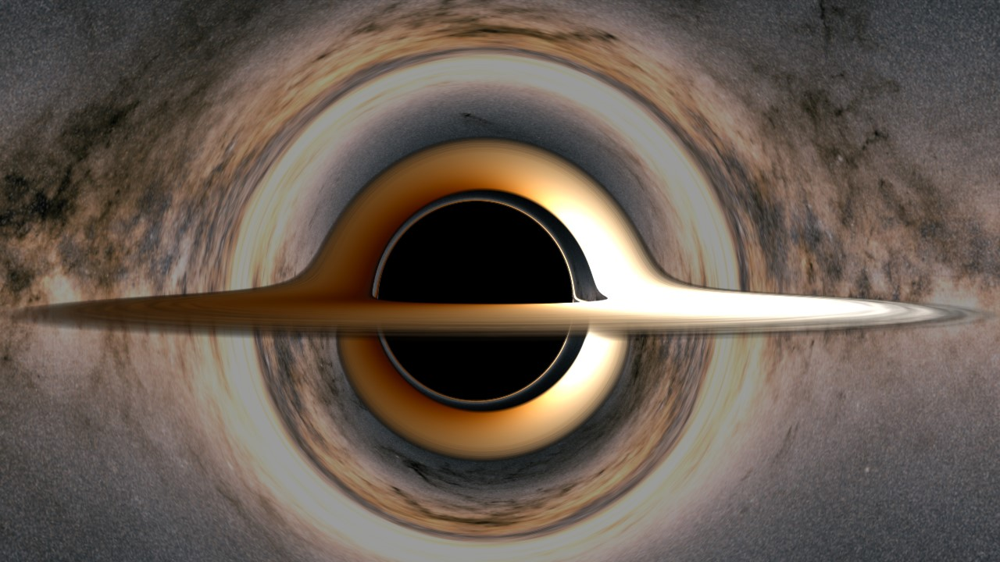
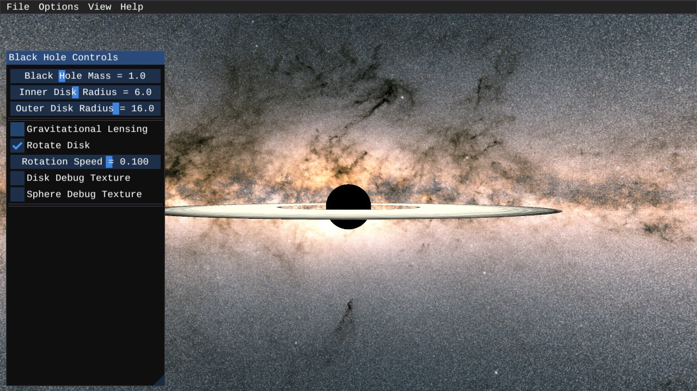

# `void*`
## A Real-Time Black Hole Ray Tracer

<p><code>void*</code> is a real-time black hole ray tracer written in C++ with OpenGL.
Fly around and observe a black hole with accretion disk against the optional backdrop of
the Milky Way galaxy.</p>


### About

<p><code>void*</code> ray marches along geodesics by using Hamilton's equations applied 
to General Relativity.  Namely, the Hamiltonian is given by</p>

$$H(x^{\alpha}, p_{\beta}) = \frac{1}{2}g^{\mu \nu}(x^{\alpha})p_{\mu}p_{\nu}$$

<p>For position $x$, momentum $p$, and metric tensor $g$.  The system of 8
differential equations is</p>

$$
\begin{align}
\frac{dx^{\alpha}}{d\lambda} &= \frac{\partial H}{\partial p_{\alpha}} = g^{\alpha \nu} p_{\nu} \\
\frac{dp_{\alpha}}{d\lambda} &= -\frac{\partial H}{\partial x^{\alpha}} = -\frac{1}{2} \frac{\partial g^{\mu \nu}}{\partial x^{\alpha}}p_{\mu}p_{\nu}
\end{align}
$$

<p>where $\lambda$ parametrizes the geodesic.  These equations are solved numerically.
The integration method is generic and can support any metric tensor, but only the Kerr
and Minkowski metrics are currently included.</p>

<p>A "cinematic mode" is included with basic lighting adjustments to create neat images.
Additionally, <code>void*</code> can draw debug colouring on both the accretion disk and
sphere in order to better make sense of what you're looking at.  By default, the top of
the accretion disk and bottom of the accretion disk are coloured differently with this 
debug colouring.</p>

### Other Screenshots







### Controls
Use `Esc` to close the menus in order to be able to move around.

```
W : Forward
S : Backward
A : Left
D : Right
Left Shift : Up
Spacebar : Down
Escape : Pause/Unpause
Right Click : Take Screenshot
Mouse Scroll : Change Movement Speed
```


### Compiling
#### Visual Studio + vcpkg

Use vcpkg to install the following:

`vcpkg install glfw3:x64-windows glfw3:x64-windows-static`

`vcpkg install imgui[core,opengl3-binding,glfw-binding,docking-experimental]:x64-windows imgui[core,opengl3-binding,glfw-binding,docking-experimental]:x64-windows-static`

`vcpkg install glm:x64-windows glm:x64-windows-static`

`vcpkg install glad[gl-api-46,loader]:x64-windows glad[gl-api-46,loader]:x64-windows-static`

`vcpkg install stb:x64-windows stb:x64-windows-static`

And make sure you've already used `vcpkg integrate install` so that Visual Studio can immediately use the installed packages.

Then just open the solution file in Visual Studio and compile.


### Credits, Inspirations, and References

- The skybox image of the Milky Way galaxy is thanks to the [European Space Agency](https://sci.esa.int/web/gaia/-/the-colour-of-the-sky-from-gaia-s-early-data-release-3-equirectangular-projection)

- The accretion disk texture is from [this](https://github.com/rantonels/starless) excellent non-realtime black hole raytracer by Riccardo Antonelli.

- The [blog](https://michaelmoroz.github.io/TracingGeodesics/) by Mykhailo Moroz was very helpful with the Hamiltonian dynamics.