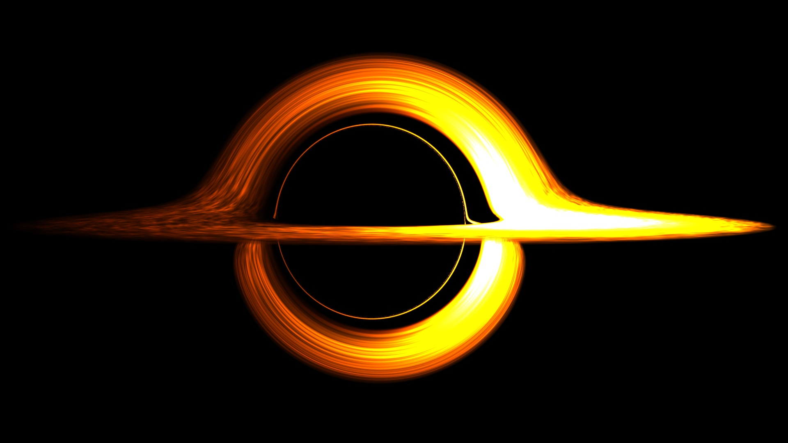
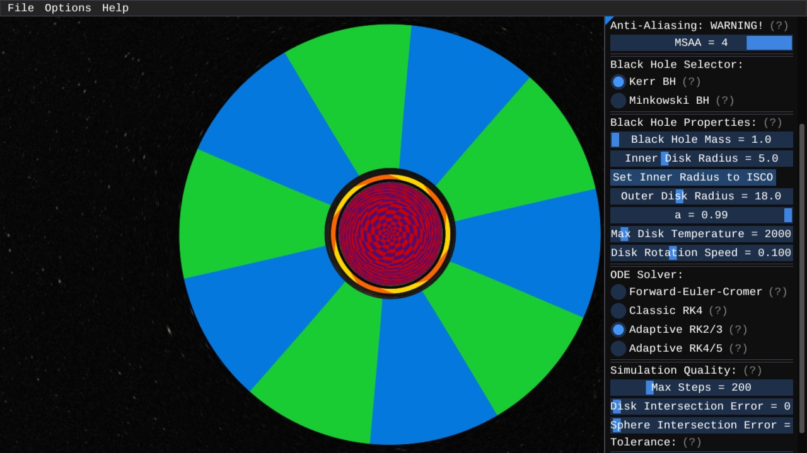

# `void*`
## A Real-Time Black Hole Ray Tracer

<p><code>void*</code> is a real-time black hole ray tracer written in C++ with OpenGL.
Fly around and observe a physically accurate spinning black hole with accretion disk against the optional backdrop of
the Milky Way galaxy.  Additionally, <code>void*</code> properly renders the infalling light
from the galaxy when the camera is located inside the event horizon.</p>



### About

<p><code>void*</code> ray marches along light-like geodesics by using Hamilton's equations applied 
to General Relativity.  Namely, the Hamiltonian is given by</p>

$$H(x, p) = \frac{1}{2}g^{\mu \nu}(x)p_{\mu}p_{\nu}$$

<p>For position $x$, momentum $p$, and metric tensor $g$.  The system of 8
differential equations is</p>

$$
\begin{align}
\frac{dx^{\alpha}}{d\lambda} &= \frac{\partial H}{\partial p_{\alpha}} = g^{\alpha \nu} p_{\nu} \\
\frac{dp_{\alpha}}{d\lambda} &= -\frac{\partial H}{\partial x^{\alpha}} = -\frac{1}{2} \frac{\partial g^{\mu \nu}}{\partial x^{\alpha}}p_{\mu}p_{\nu}
\end{align}
$$

<p>where $\lambda$ parametrizes the geodesic.  These equations are solved numerically.
Multiple integration methods from the Runge-Kutta family are implemented and can support
any metric tensor.  The Kerr and Minkowski metrics are currently included.</p>

<p>A "cinematic mode" is included with lighting options to create neat images.
Additionally, <code>void*</code> can draw debug colouring on both the accretion disk and
sphere in order to better make sense of what you're looking at.  By default, the top of
the accretion disk and bottom of the accretion disk are coloured differently.</p>

### Other Screenshots
<p>Interstellar-esque</p>


<p>Disk and sphere debug texture close-up of a near extremal black hole ($a=0.99$).</p>


<p>Top-down view with disk and sphere debug of a near extremal black hole ($a=0.99$).  Also showing the options menu.</p>



<p>Minkowski metric (i.e. flat space without gravitational lensing)</p>


### Controls
Use `Esc` to close the menus in order to be able to move around.

```
W : Forward
S : Backward
A : Left
D : Right
Left Shift : Up
Spacebar : Down
Escape : Pause/Unpause
Right Click : Take Screenshot
Mouse Scroll : Change Movement Speed
```


### Compiling
#### Visual Studio + vcpkg on Windows

Use vcpkg to install the following:

`vcpkg install glfw3:x64-windows-static`

`vcpkg install imgui[core,opengl3-binding,glfw-binding,docking-experimental]:x64-windows-static`

`vcpkg install glm:x64-windows-static`

`vcpkg install glad[gl-api-46,loader]:x64-windows-static`

`vcpkg install stb:x64-windows-static`

And make sure you've already used `vcpkg integrate install` so that Visual Studio can immediately use the installed packages.

Then just open the solution file in Visual Studio and compile.


### References

- The skybox image of the Milky Way galaxy is thanks to the [NASA](https://svs.gsfc.nasa.gov/4851)
- "Einstein Gravity in a Nutshell" by Zee
- "Gravitation" by Misner, Thorne, and Wheeler
- ["The Kerr spacetime: A brief introduction"](https://arxiv.org/abs/0706.0622) by Matt Visser (2008)
- The [blog](https://michaelmoroz.github.io/TracingGeodesics/) by Mykhailo Moroz
- ["Disk-accretion onto a black hole"](https://ui.adsabs.harvard.edu/abs/1974ApJ...191..499P/abstract) by Page and Thorne (1973)
- ["Detecting Accretion Disks in Active Galactic Nuclei"](https://ui.adsabs.harvard.edu/abs/1997PASJ...49..159F/abstract) by Fanton, et al (1997)
- ["Line shifts in accretion disks - the case of Fe Ka"](https://arxiv.org/abs/1601.02389) by Jovanovic, et al (2016)
- ["Gravitational Lensing by Spinning Black Holes in Astrophysics, and in the Movie Interstellar"](https://arxiv.org/abs/1502.03808) by James et al (2015)